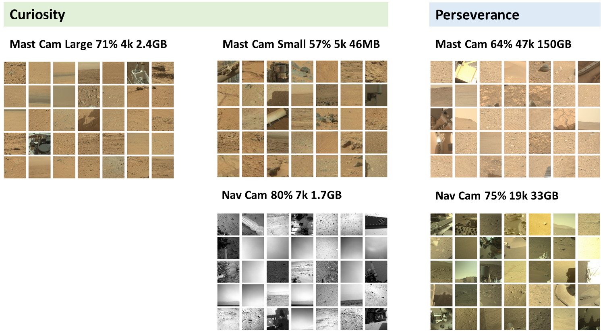
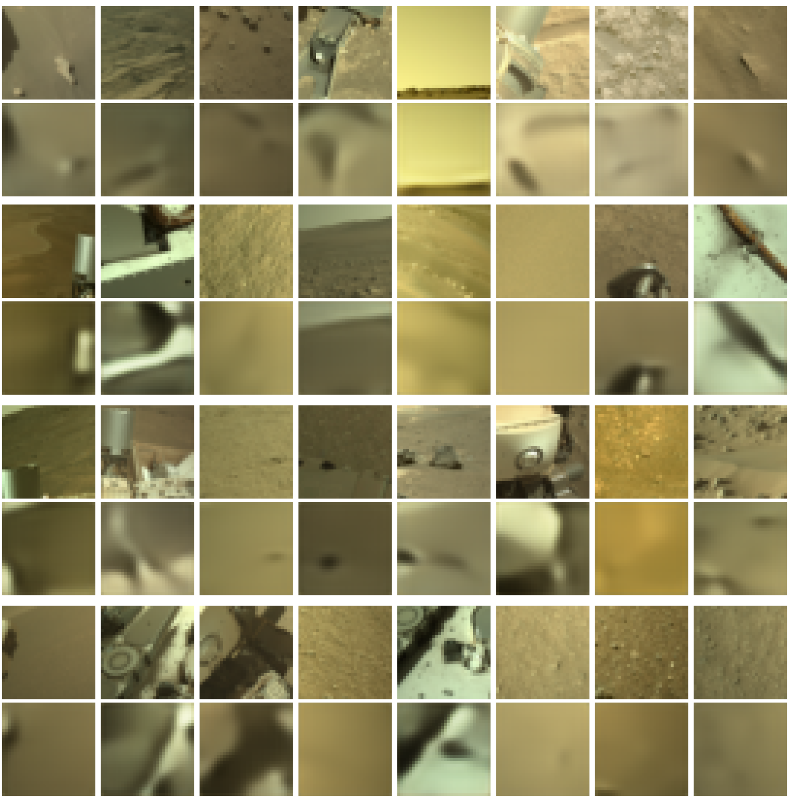
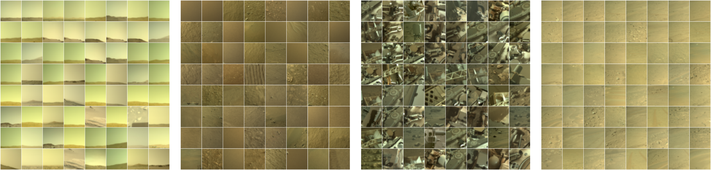
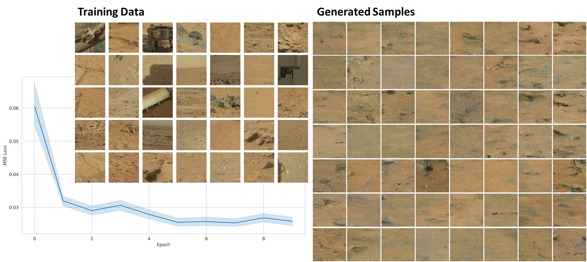
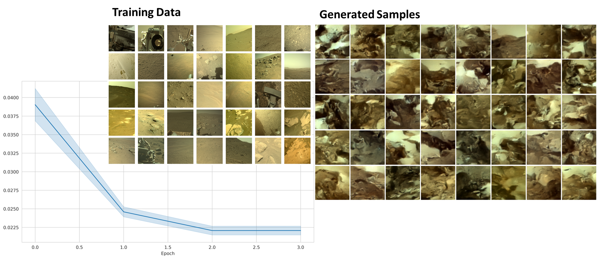

# deep-learning-with-curiosity-and-perseverance

# Abstract
This project aimed to implement several machine-learning algorithms for the analysis of Mars rover images. The first objective was to download, structure, filter, and sort the large corpus of images acquired by the Mars rovers Curiosity and Perseverance. The second objective was to explore how different machine learning algorithms perform on this particular dataset. The following three tasks were addressed: Clustering, image colorization, and denoising diffusion. The implementation of an autoencoder with k-means clustering gave us a better understanding of the dataset. The clustering recovered meaningful clusters that all fall into one of the categories of ground, horizon, sky, and rover parts. Image colorization was implemented using two different convolutional neural networks that were trained with the mean squared error loss and the cross-entropy loss, respectively. Both were able to produce highly realistic images. Eventually, a diffusion model was trained on the dataset, which is useful to generate a larger dataset that enables the training of models that generalize better. Along with these experiments, this project provides a fully automated pipeline that allows us to easily create more datasets with the newest images or the images from the more specialized cameras.


# Datasets



## Autoencoder Reconstruction

## Latent Clustering (4 of 30 k-means clusters)

## Colorization on Training Set (Perseverance, Navcam)

## Colorization on Test Set (Curiosity, Navcam)

## Denoising Diffusion




# Repository Structure
To maintain a clean, organized, and reproducible codebase, we follow a structured layout. Below is an overview of the repository structure:

```
deep-learning-with-curiosity-and-perseverance/
│
├── data/
│   ├── curiosity/
│   │   ├── CHEMCAM/
│   │   │   ├── CR0_397506222EDR_F0010008CCAM00000M_.JPG
│   │   │   └── ...
│   │   └── .../
│   ├── perceverance/
│   │   ├── NAVCAM_LEFT/
│   │   │   ├── NLB_0906_0747368827_599ECM_N0442062NCAM00502_03_1I6J02.png
│   │   │   └── ...
│   │   └── .../
│   ├── datasets/
│   │   ├── curiosity_mast_color_large/
│   │   ├── curiosity_mast_color_small/
│   │   ├── curiosity_navcam_gray/
│   │   ├── perseverance_mast_color/
│   │   └── perseverance_navcam_color/
│   └── urls/
│        ├── curiosity/
│        │   ├── 0000.json
│        │   ├── ...
│        │   └── 3944.json
│        └── perceverance/
│            ├── 0000.json
│            ├── ...
│            └── 0558.json
│
├── src/
│   ├── data_preprocessing/
│   ├── models/
│   ├── training/
│   ├── evaluation/
│   └── utils/
│ 
├── jobs/
│
├── scripts/
│
├── figures/
│
├── requirements.txt
│
├── README.md
│
└── setup.py

```

**Directory Structure Explanation:**

**data/**: This directory is reserved for data management.
   - **curiosity/**: The original, unprocessed data is stored here.
   - **perceverance/**: The original, unprocessed data is stored here.
   - **datasets/**: The filtered datasets reside here.

**src/**: The source code is organized into subdirectories:
   - **data_preprocessing/**: Contains code for data loading, augmentation, and transformation.
   - **models/**: The neural network architectures are defined here.
   - **training/**: Includes code for training loops, loss functions, and optimizers.
   - **evaluation/**: Includes code for model evaluation, visualization, etc.
   - **utils/**: Utility functions and helper scripts that can be reused.

**jobs/**: Contains scripts for job submission on Euler.

**scripts/**: Contains batch scripts for data preprocessing, training, and evaluation on Euler.

**figures/**: All figures are stored here.

**requirements.txt**: Contains all dependencies.

**README.md**: This file.

# Installation on Euler cluster
```commandline
cd scripts
sbatch job_install_pip.sh
source startup.sh
cd ..
```
or 
```commandline
cd scripts
source install_pip.sh
```
